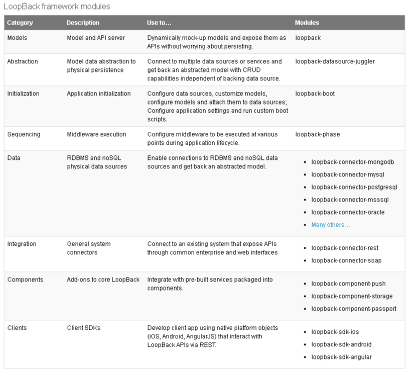
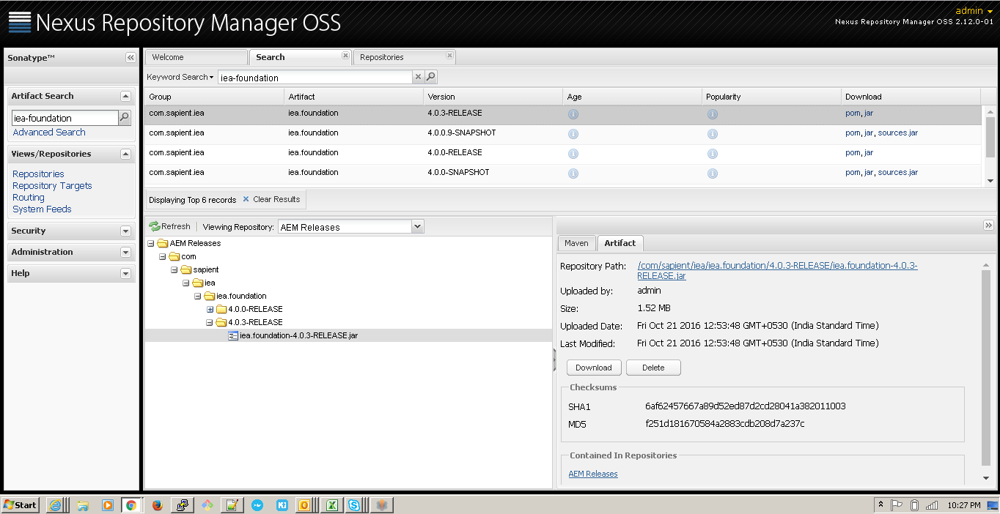

# Topic 1

Node.js(r) is a JavaScript runtime built on [Chrome's V8 JavaScript engine][0]. Node.js uses an event-driven, non-blocking I/O model that makes it lightweight and efficient. Node.js' package ecosystem, [npm][1], is the largest ecosystem of open source libraries in the world.

# Topic 2

Node.js(r) is a JavaScript runtime built on [Chrome's V8 JavaScript engine][0]. Node.js uses an event-driven, non-blocking I/O model that makes it lightweight and efficient. Node.js' package ecosystem, [npm][1], is the largest ecosystem of open source libraries in the world.

# TableColumn1Column2Column3

Data1Data2Data3

Data4Data5Data6

# Image Attachment

"

"

# File Attachments

[summitstore-api-integrator\_test.xlsx][2]

[GIT.txt][3]

[sampleDoc.docx][4]  

[0]: https://developers.google.com/v8/
[1]: https://www.npmjs.com/
[2]: summitstore-api-integrator_test.xlsx
[3]: GIT.txt
[4]: sampleDoc.docx